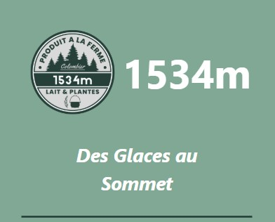
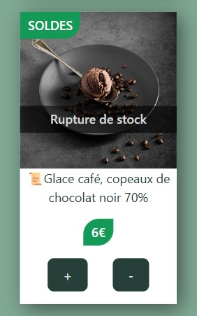
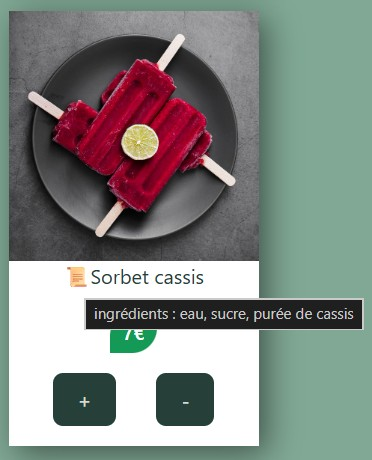
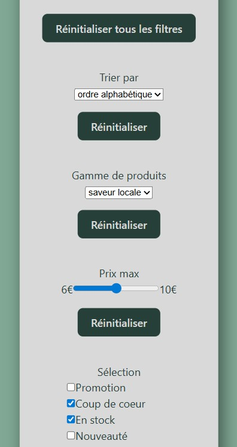
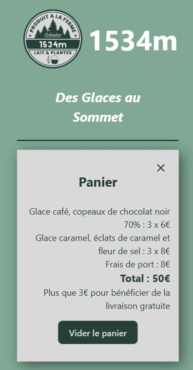
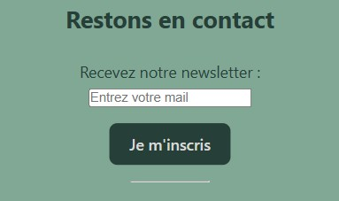

# ❄️ Glacier 1534m

Un site vitrine React Mobile first pour découvrir, filtrer et commander les produits d’une ferme fictive du Bugey commercialisant en ligne des glaces artisanales.  
🔗 <a href="https://MathildeGuedon.github.io/1534m" target="_blank" rel="noopener noreferrer">Voir le site en ligne</a>

## Aperçu visuel

## À propos

Ce projet a été réalisé dans un cadre d’auto-formation au développement front-end. Tous les contenus (textes, images, produits) sont fictifs et à vocation pédagogique uniquement.

## Fonctionnalités

- **Mobile first** : Site conçu pour une utilisation sur support mobile d'abord
- **Design responsive** : Expérience fluide quel que soit le support : mobile, tablette ou ordinateur.
- **Filtrage des résultats** : Affichage des fiches produits selon différents critères.
- **Mémorisation du panier en local** : Sauvegarde du panier même en cas de fermeture du site grâce au localStorage
- **Formulaire contrôlé** : Vérification de la validité de l'adresse mail au fur et à mesure de la saisie par l'utilisateur.

## Technologies utilisées
- React, Vite
- JSX
- HTML5, CSS3
- Illustrations : Freepik (cité dans les mentions légales)

## Objectifs pédagogiques

Ce projet m’a permis de :
- Concevoir une **architecture modulaire** en composants réutilisables avec React.
- Maximiser l'**accessibilité** du site (textes alternatifs des images, Placeholder du formulaire).
- Mettre en œuvre du **JSX** au sein des composants React.
- Gérer les **événements utilisateur**, la validation de formulaire contrôlé, et la manipulation des composants.
- Manipuler des **hooks** tels que useState et useEffect
- Utiliser des **effets de bord** (mise à jour dynamique du titre de l'onglet)
- Fluidifier l'**expérience utilisateur** (effet au survol des liens, infobulle au survol d'icônes, boutons d'appel à l'action)

## Captures d'écran

### Présentation et information des produits

### Effet au survol des liens

### Tri et Filtres des fiches produits

### Panier

### Effet de bord sur l'onglet

### Formulaire contrôlé

## Améliorations futures
- **Carrousel** : Mettre en évidence de quelques produits choisis 
- **Compteur d'articles** : Afficher en temps réel la quantité d'articles dans le panier
- **Validation du panier** : Déclencher une alerte lorsque la commande est validée
- **Compte à rebours** : Afficher un décompte lors d'actions promotionnelles
- **Base de données** : Remplacer les données statiques par une API
- **React Router** : Créer des routes vers d'autres pages (mentions légales, à propos par exemple)
- **Thème sombre** : Ajouter un thème sombre pour améliorer l'accessibilité
- **Système de notation** : Permettre aux utilisateurs de voter pour leurs produits préférés

## Contact

Mathilde Guédon - mathilde2.guedon@hotmail.fr - 
<a href="https://www.linkedin.com/in/mathilde-guédon-a08a08369" target="_blank" rel="noopener noreferrer">LinkedIn</a>
